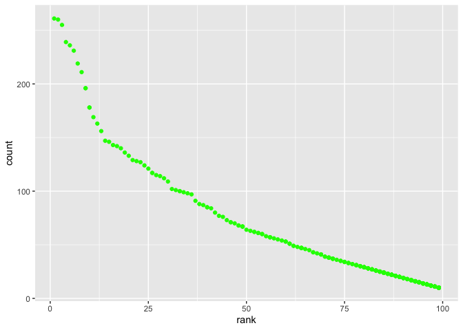

p8105\_hw2\_xm2276.Rmd
================
XIAO MA
10/8/2021

``` r
library(tidyverse)
```

    ## ── Attaching packages ─────────────────────────────────────── tidyverse 1.3.1 ──

    ## ✓ ggplot2 3.3.5     ✓ purrr   0.3.4
    ## ✓ tibble  3.1.4     ✓ dplyr   1.0.7
    ## ✓ tidyr   1.1.3     ✓ stringr 1.4.0
    ## ✓ readr   2.0.1     ✓ forcats 0.5.1

    ## ── Conflicts ────────────────────────────────────────── tidyverse_conflicts() ──
    ## x dplyr::filter() masks stats::filter()
    ## x dplyr::lag()    masks stats::lag()

``` r
library(ggplot2)
library(readxl)
```

## Problem 0

### import the data

``` r
trash_df = read_excel("data/Trash-Wheel-Collection-Totals-7-2020-2.xlsx")
```

    ## New names:
    ## * `` -> ...15
    ## * `` -> ...16
    ## * `` -> ...17

## problem 1

cleaning data reading the sheet

``` r
trash_df = read_excel("data/Trash-Wheel-Collection-Totals-7-2020-2.xlsx",
                      sheet = "Mr. Trash Wheel") %>%
                      janitor::clean_names() %>%
                      drop_na(dumpster) %>%
                      mutate(round(sports_balls, digits = 0))
```

    ## New names:
    ## * `` -> ...15
    ## * `` -> ...16
    ## * `` -> ...17

``` r
Prec2018 = read_excel("data/Trash-Wheel-Collection-Totals-7-2020-2.xlsx",
                      sheet = "2018 Precipitation",
                      range = "A2:B14") %>%
                      mutate(Year = "2018")
Prec2018
```

    ## # A tibble: 12 × 3
    ##    Month Total Year 
    ##    <dbl> <dbl> <chr>
    ##  1     1  0.94 2018 
    ##  2     2  4.8  2018 
    ##  3     3  2.69 2018 
    ##  4     4  4.69 2018 
    ##  5     5  9.27 2018 
    ##  6     6  4.77 2018 
    ##  7     7 10.2  2018 
    ##  8     8  6.45 2018 
    ##  9     9 10.5  2018 
    ## 10    10  2.12 2018 
    ## 11    11  7.82 2018 
    ## 12    12  6.11 2018

``` r
Prec2019 = read_excel("data/Trash-Wheel-Collection-Totals-7-2020-2.xlsx",
                      sheet = "2019 Precipitation",
                       range = "A2:B14") %>%
                      mutate(Year = "2019")
Prec2019
```

    ## # A tibble: 12 × 3
    ##    Month Total Year 
    ##    <dbl> <dbl> <chr>
    ##  1     1  3.1  2019 
    ##  2     2  3.64 2019 
    ##  3     3  4.47 2019 
    ##  4     4  1.46 2019 
    ##  5     5  3.58 2019 
    ##  6     6  0.42 2019 
    ##  7     7  3.85 2019 
    ##  8     8  2.39 2019 
    ##  9     9  0.16 2019 
    ## 10    10  5.45 2019 
    ## 11    11  1.86 2019 
    ## 12    12  3.57 2019

``` r
Prec_20182019 = bind_rows(Prec2018,Prec2019) %>%
                mutate(month.name[Month]) %>%
  relocate(Year)
```

The **number of observations of trash\_df** contains 454 dumpsters
through 9 years. There are 17 numbers of variables of trash\_df The**key
variables** are chip\_bags, cigarette\_butts, date, dumpster,
glass\_bottles, grocery\_bags, homes\_powered, month, plastic\_bottles,
polystyrene, round(sports\_balls, digits = 0), sports\_balls,
volume\_cubic\_yards, weight\_tons, x15, x16, x17, year There are 12
number of observations of Prec2018 The 3 numbers of variables of
Prec2018 The**key variables** is total\_amount of prep There are 12
number of observations of Prec2019 There are 3 numbers of variables of
Prec2019 The**key variables** are Month, Total, Year

The total precipitation in 2018 is 70.33. The median number of sports
balls in a dumpster in 2019 is 3.55 inch

The total precipitation in 2018 is 70.33. The median number of sports
balls in a dumpster in 2019 is 4.35 inch

## Problem 2

``` r
pols_month_df = read_csv("data/fivethirtyeight_datasets/pols-month.csv")
```

    ## Rows: 822 Columns: 9

    ## ── Column specification ────────────────────────────────────────────────────────
    ## Delimiter: ","
    ## dbl  (8): prez_gop, gov_gop, sen_gop, rep_gop, prez_dem, gov_dem, sen_dem, r...
    ## date (1): mon

    ## 
    ## ℹ Use `spec()` to retrieve the full column specification for this data.
    ## ℹ Specify the column types or set `show_col_types = FALSE` to quiet this message.

``` r
pols_month_df = pols_month_df %>%
  separate(mon,into = c("year","month","day")) %>%
  mutate(
    year = as.integer(year),
    month = as.integer(month),
    day = as.integer(day)) %>%
mutate(month = month.name[month]) %>%
mutate(year = as.character(year)) %>%
drop_na(prez_gop) %>%
mutate(president = ifelse(prez_gop == 1, "gop","dem")) %>%
select(-prez_dem,-prez_gop,-day)
pols_month_df
```

    ## # A tibble: 822 × 9
    ##    year  month     gov_gop sen_gop rep_gop gov_dem sen_dem rep_dem president
    ##    <chr> <chr>       <dbl>   <dbl>   <dbl>   <dbl>   <dbl>   <dbl> <chr>    
    ##  1 1947  January        23      51     253      23      45     198 dem      
    ##  2 1947  February       23      51     253      23      45     198 dem      
    ##  3 1947  March          23      51     253      23      45     198 dem      
    ##  4 1947  April          23      51     253      23      45     198 dem      
    ##  5 1947  May            23      51     253      23      45     198 dem      
    ##  6 1947  June           23      51     253      23      45     198 dem      
    ##  7 1947  July           23      51     253      23      45     198 dem      
    ##  8 1947  August         23      51     253      23      45     198 dem      
    ##  9 1947  September      23      51     253      23      45     198 dem      
    ## 10 1947  October        23      51     253      23      45     198 dem      
    ## # … with 812 more rows

Secondly,

``` r
snp_df = read_csv("data/fivethirtyeight_datasets/snp.csv") %>%
      separate(date, into = c("month","day","year"), sep = "/") %>%
      mutate(year = as.numeric(year) + 2000) %>%
      mutate(year = ifelse(year >= "2050", year - 100, year)) %>%
      mutate(year = as.character(year)) %>%
      mutate(month = as.numeric(month)) %>%
      arrange(year, month) %>%
      mutate(month = month.name[month]) %>%
      mutate(year, month) %>%
      select(-day)
```

    ## Rows: 787 Columns: 2

    ## ── Column specification ────────────────────────────────────────────────────────
    ## Delimiter: ","
    ## chr (1): date
    ## dbl (1): close

    ## 
    ## ℹ Use `spec()` to retrieve the full column specification for this data.
    ## ℹ Specify the column types or set `show_col_types = FALSE` to quiet this message.

Thirdly,

``` r
unemploy_df = read_csv("data/fivethirtyeight_datasets/unemployment.csv") %>% 
  pivot_longer(Jan:Dec,
  names_to = "month",values_to = "unemployment") %>%
  mutate(month = match(month, month.abb)) %>%
  mutate(month = month.name[month]) %>%
  janitor::clean_names() %>%
  mutate(year = as.character(year))
```

    ## Rows: 68 Columns: 13

    ## ── Column specification ────────────────────────────────────────────────────────
    ## Delimiter: ","
    ## dbl (13): Year, Jan, Feb, Mar, Apr, May, Jun, Jul, Aug, Sep, Oct, Nov, Dec

    ## 
    ## ℹ Use `spec()` to retrieve the full column specification for this data.
    ## ℹ Specify the column types or set `show_col_types = FALSE` to quiet this message.

``` r
#join the data set
pols_snp = left_join(pols_month_df, snp_df, by = c("year","month"))
pols_snp_unemploy = left_join(pols_snp, unemploy_df, by = c("year", "month"))
```

Write a short paragraph about these datasets. Explain briefly what each
dataset contained, and describe the resulting dataset (e.g. give the
dimension, range of years, and names of key variables).

**The dimension of observations** of pols\_month\_df is 822 and 9 **The
range of the years** of pols\_month\_df is 1947, 2015 **key variables**
are `ls(pols_month_df)`

For the second dataset **The dimension of observations** of snp\_df is
787 and `ncol(snp_df)` **The range of the years** of snp\_df is 1950,
2015 **key variables** are `ls(snp_df)`

For the third dataset **The dimension of observations** of unemploy\_df
is 816 and 3 **The range of the years** of unemploy\_df is 1948, 2015
**key variables** are `ls(unemploy_df)`

\#\#problem3

``` r
pop_names = 
  read_csv("data/Popular_Baby_Names.csv") %>%
  janitor::clean_names() %>%
  mutate(gender = tolower(gender)) %>%
  mutate(ethnicity = gsub(" ", "_",ethnicity)) %>%
  mutate(ethnicity = tolower(ethnicity)) %>%
  mutate(childs_first_name = tolower(childs_first_name)) %>%
  distinct( )
```

    ## Rows: 19418 Columns: 6

    ## ── Column specification ────────────────────────────────────────────────────────
    ## Delimiter: ","
    ## chr (3): Gender, Ethnicity, Child's First Name
    ## dbl (3): Year of Birth, Count, Rank

    ## 
    ## ℹ Use `spec()` to retrieve the full column specification for this data.
    ## ℹ Specify the column types or set `show_col_types = FALSE` to quiet this message.

``` r
pop_names
```

    ## # A tibble: 12,181 × 6
    ##    year_of_birth gender ethnicity                  childs_first_name count  rank
    ##            <dbl> <chr>  <chr>                      <chr>             <dbl> <dbl>
    ##  1          2016 female asian_and_pacific_islander olivia              172     1
    ##  2          2016 female asian_and_pacific_islander chloe               112     2
    ##  3          2016 female asian_and_pacific_islander sophia              104     3
    ##  4          2016 female asian_and_pacific_islander emily                99     4
    ##  5          2016 female asian_and_pacific_islander emma                 99     4
    ##  6          2016 female asian_and_pacific_islander mia                  79     5
    ##  7          2016 female asian_and_pacific_islander charlotte            59     6
    ##  8          2016 female asian_and_pacific_islander sarah                57     7
    ##  9          2016 female asian_and_pacific_islander isabella             56     8
    ## 10          2016 female asian_and_pacific_islander hannah               56     8
    ## # … with 12,171 more rows

``` r
##olivia
olivia = 
  filter(pop_names, childs_first_name == "olivia", gender == "female") %>%
  select(rank, year_of_birth, ethnicity) %>%
  arrange(year_of_birth)

##male names

pop_male_names = 
  filter(pop_names,gender == "male", rank == 1 ) %>%
  select(rank, year_of_birth, ethnicity) %>%
  arrange(year_of_birth)

name_2016 = filter(pop_names,year_of_birth == "2016", gender == "male", ethnicity == "white_non_hispanic")

ggplot(name_2016) + geom_point(aes(rank,count),color = "green")
```

<!-- -->

``` r
ggsave("2016names.pdf")
```

    ## Saving 7 x 5 in image
